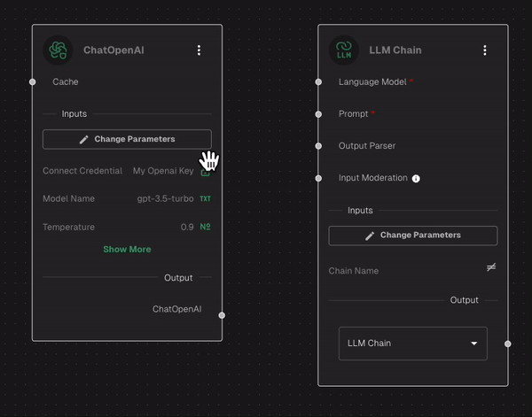

# Creating a simple LLM app

To create your first LLM app, you'll need 3 things:  credential, one LLM Node and one LLM Chain node.

For the sake of this example, we'll make an app that uses ChatGPT.&#x20;

### 1. Create New Chatbot

Open the main menu and click on "Chatbots" -> "Create new chatbot"

<figure><figcaption>
Create new chatbot
</figcaption></figure>

### 2. Give it a name

<figure><figcaption>
Give a name
</figcaption></figure>

### 3. Add a new node "ChatOpenAI"

Click on the green floating button to add a new node, and search for "ChatOpenAI". Then, drag and drop it on the editor pane:

<figure><figcaption>
Add ChatOpenAI Node
</figcaption></figure>

### 4. Set the credentials

Click on "Change Parameters" button. It'll open the node's details where you will search for the [credentials you've created](getting-started/adding-credentials.md) earlier. Then **Save Node Parameters**

<figure><figcaption>
Here you can also configure other parameters if you want
</figcaption></figure>

### 5. Add a "LLM Chain" node

Click on the green floating button to add a new node, and search for "LLM Chain". Then, drag and drop it on the editor pane:

<figure><figcaption>
Add LLM Chain node
</figcaption></figure>

### 6. Connect the dots

<figure><figcaption></figcaption></figure>

